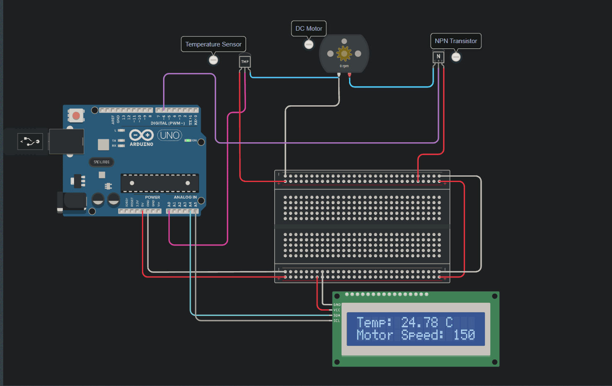

# Arduino Heat Optimizer
## What is  Arduino Heat Optimizer System
The Arduino Heat Optimizer System enhances cooling efficiency to sustain ideal temperatures for DC motors.
## Heat Optimizer Components
The Arduino Heat Optimizer System for Cooling Efficiency is a solution designed to regulate temperatures for DC motors. It integrates a range of components, including a temperature sensor, DC motor, transistor, and an LCD screen. The temperature sensor continuously monitors heat levels, enabling precise adjustments. Controlled by the microcontroller, the fan modulates its speed to maintain optimal conditions. Meanwhile, the LCD screen provides real-time displays of temperature and motor speed, ensuring efficient operation and effective temperature management.

